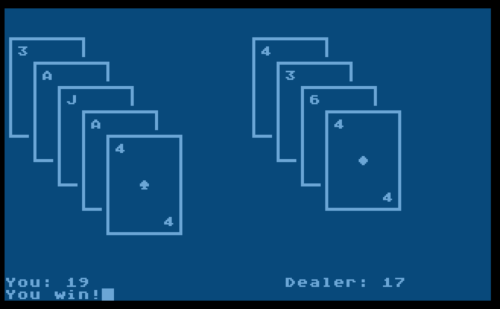
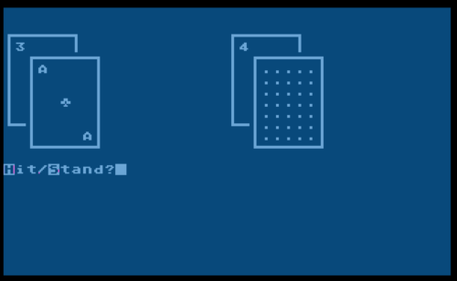

# 10line-blackjack
Blackjack game in Turbo BASIC XL for Atari 8-bit. Entry for 2020 10-line BASIC contest

Hot on the heels of the poker game, I wrote a blackjack game for the 10-line BASIC contest. It is also in TurboBASIC XL on the Atari 8-bit, and also in ten 120-character lines. I borrowed the card shuffling code from the poker game, but otherwise it’s all new code.

As always with these short programs, there were some space tradeoffs. In exchange for a wallet/calculating money, I found room to show simple card graphics. I also had to give up the custom character with the cute little “10” character. Instead, “T” represents the 10 card.

Like standard blackjack, it starts by dealing your two cards face up, one dealer card face up and one face down. You can press H to hit (take another card) or S to stand (stop taking cards.) (This version does not support doubling down or splitting hands.) After you Stand, it reveals the dealer’s face-down card and the dealer plays. The dealer follows standard Las Vegas rules: always hitting on 16 or less; always standing on 17 or more.

The biggest challenge was calculating Aces, which in Blackjack can count for either 1 or 11. When figuring the player’s score, it starts by assuming an Ace is worth 1. When the player Stands: if the player holds an ace and counting it as 11 won’t cause the player’s total to exceed 21, it adds 10 to the player’s total. On the other hand, when calculating the dealer’s score, it starts by assuming an Ace is worth 11. If after a hit the dealer’s total exceeds 21 and it holds an Ace, it reduces the dealer’s total by 10 and keeps on playing.
